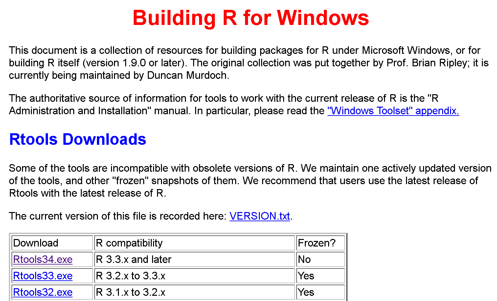
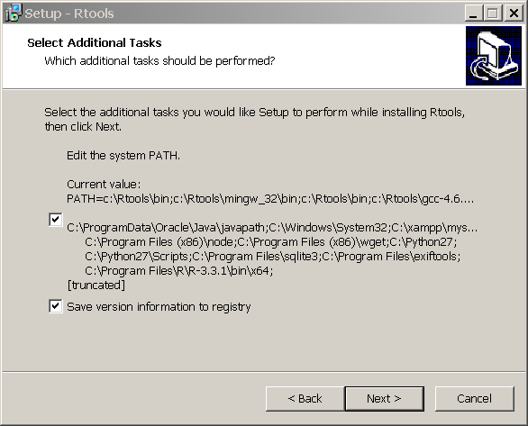
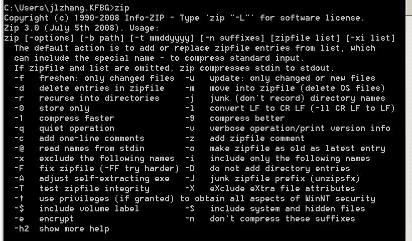
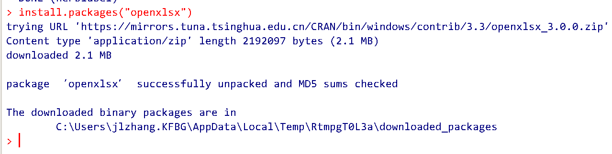
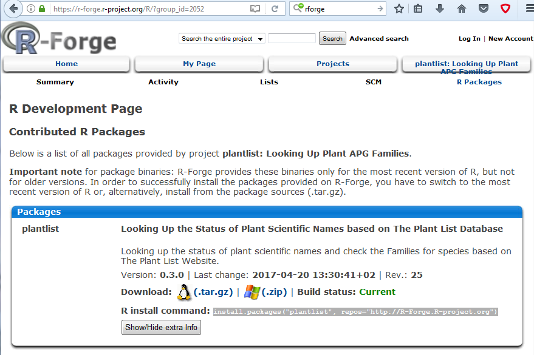
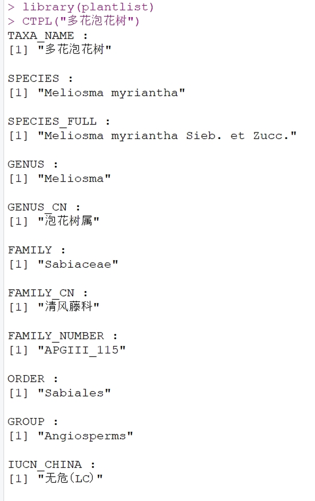
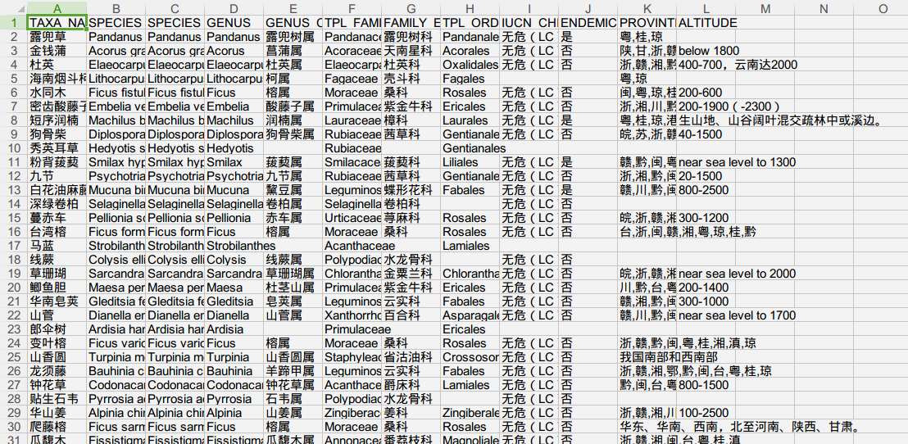

# 简介

plantlist是用来查询和处理植物学名的R程序包，自2013年以来，受到很多植物学和生态学很多老师和同学的关注。R软件中，类似的程序包还有 taxize (https://cran.r-project.org/web/packages/taxize/index.html)、Taxonstand(https://cran.r-project.org/web/packages/Taxonstand/index.html)等。 

相比之下plantlist的主要特点在于：

1. 使用校对过的内置数据，不需要联网

2. 优化了查询单个物种名是否为接受名的算法，速度比taxize更快

3. 查询结果所显示的信息更加简洁清晰

4. 支持用中文名批量查询学名

## plantlist的主要功能

1.  批量查询植物科属，内置的数据主要来源于The Plant List网站(www.theplantlist.org/)，其中被子植物采用APGIII分类系统，同时提供维管植物每个科的编号，极大方便了植物标本的管理，方便植物名录处理等。

2.  直接生成科/属/种的列表, 以便导入Phylomatic等软件生成进化树

3.  用中文名批量查询植物学名以及科属

4.  查询学名的接受状态以及完整学名等

## plantlist包内的函数

* `CTPL()` 用中文名查询每个种的科、属、分布、海拔、IUCN等级数据

* `CTPL2()` 功能与CTPL类似，但`CTPL2()`只读写Excel文件，而CTPL在查询时要直接输入中文字符。

* `status()` 查询每个学名在The Plant List  1.1数据库中的接受状态（该数据库已经放在程序包中）

* `taxa.table()` 基于TPL查询结果制作科、属、种列表， 以便用Phylomatic软件建立进化树

* `TPL()` 用学名查询目、科、属以及科在分类系统中的编号

## 内置数据

* `acc_dat`: The Plant List网站上的所有接受名

* `cnplants_dat`:   《中国植物名录》及每个种的科、属、分布、海拔、中国IUCN等级以及特有性等数据

* `genera_dat`: The Plantlist网站上的所有属名列表，因源数据有一些错误，绝大部分已经修订。

* `orders_dat`: Angiosperm Phylogeny Website  (www.mobot.org/MOBOT/research/APweb/
) 提供的各科所属的目。

* `syn_dat`: The Plant List 1.1 网站的异名数据库

# 软件安装

plantlist必须要先安装R才能使用。由于plantlist内部函数`CTPL2`函数需要使用openxlsx程序包读取xlsx文件，所以也要安装openxlsx所依赖的Rtools以及Rcpp，并配置好启动路径才能正常使用。

## 安装R软件

R软件下载的地址为:(http://cran.r-project.org/bin/windows/base/)。请尽量下载最新版本的R并按照默认路径安装。因为程序运行过程中涉及UFT8字符转换，所以R版本不能低于3.0.3。

{ width=90% }

图1. R软件windows版本下载页

{ width=90% }

图2. R软件3.3.1的登录界面

## 安装Rstudio

推荐用Rstudio的Console输入函数查询，这是因为在部分Windows系统中， R自带的RGui中无法正常输入汉字，而Rstudio较好地解决了字符编码和汉字输入的问题。

涉及字符编码时，建议所有文本文件都使用UTF-8，这样可以降低出现乱码的可能性。

Rstudio可以在(https://www.rstudio.com/products/rstudio/download/) 下载。

## 安装Rtools

Rtools是编写R程序包的工具软件，含有读写xlsx文件所需的unzip和zip函数，安装时**必须允许Rtools修改启动路径**。

Rtools的下载地址为(https://cran.r-project.org/bin/windows/Rtools/)。安装Rtools时须允许其修改系统路径system PATH。

{ width=90% }

图3. Rtools下载页面，**请以列表中第一行未冻结的版本为准**

{ width=90% }

图4. 安装Rtools时应该允许其修改system PATH

Rtools安装完成后可以通过以下方式检查是否安装成功:

{ width=90% }

图5. 在控制台中输入zip, 如图所示，若未提示错误，则Rtools安装和配置成功

## 安装openxlsx程序包

openxlsx程序包用来读取和保存带有植物名录的xlsx模板，在Rconsole中输入：

```R
install.packages("openxlsx")
```

然后，在弹出的窗口选择距离较近的CRAN镜像，openxlsx程序包会自动下载并安装好。部分地区由于网络限制，不一定能打开r-project网站的云服务，以致报错。此时可以用以下命令从指定的CRAN镜像网站安装:

```R
install.packages("ctv", repos = "http://cran.R-project.org")
```

其中 http://cran.R-project.org 可以替换为任何CRAN镜像名。CRAN镜像列表可在以下网址查看：https://cran.r-project.org/mirrors.html

{ width=90% }

图6. 通过`install.packages`命令安装openxlsx程序包

## 安装 plantlist程序包

由于plantlist程序包中有非ASCII码，所以一直没有上传到CRAN。plantlist包的稳定版本在R-Forge (https://r-forge.r-project.org/R/?group_id=2052), 最新版本的源代码保存在github。

{ width=90% }

图7. Rforge网站上plantlist的页面

### 从R-Forge下载安装

命令是:

```R
install.packages("plantlist", repos="http://R-Forge.R-project.org")
```
### 从github下载和安装

plantlist的github网址是(https://www.github.com/helixcn/plantlist)。可使用如下命令安装：

```R
devtools::install_github("helixcn/plantlist")
```

若尚未安装devtools, 需要输入以下命令安装:

```R
install.packages("devtools")
```

至此，plantlist及其依赖的程序包都安装好了。

# plantlist各函数的使用方法

在使用plantlist之前，必须用`library(plantlist)` 加载plantlist。查询每个函数的使用方法， 请输入`?函数名`，例如： `?TPL`即可查看TPL函数的帮助界面。

## `CTPL()` 用中文名查询科、属、分布、海拔、IUCN等级数据

示例代码如下：
```R
library(plantlist)
CTPL(c("杨梅", "多花泡花树"))
CTPL(c("网脉实蕨", "江南星蕨"))

# 将结果保存到Excel文件中
library(openxlsx)
rrr <- CTPL(c("侧金盏花", 
              "多花泡花树", 
              "网脉山龙眼", 
              "绿樟", 
              "网脉实蕨"))
write.xlsx(rrr, "results.xlsx")

# 纯文本文件的读写
# Save to UTF-8
writeLines(text = c("桃儿七", 
                    "连香树", 
                    "水青树", 
                    "绿樟", 
                    "网脉实蕨"), 
    con = "test_species.txt", 
    useBytes = TRUE)
sp <- readLines("test_species.txt", encoding = "UTF-8")
CTPL(sp)
```

{ width=80% }

图 8. CTPL的查询结果

## `CTPL2()` 用中文名查询科、属、分布、海拔、IUCN等级数据

`CTPL2`可以直接读取Excel文件第一列的数据，并以此和内置的`cnplants_dat`数据匹配，结果保存在自动生成的xlsx文件中。示例代码如下：

```R
# Example of CTPL2
library(plantlist)
library(openxlsx)
species <- data.frame(plants = c("侧金盏花",
                                 "多花泡花树", 
                                 "网脉山龙眼", 
                                 "绿樟", 
                                 "网脉实蕨",
                                 "无根藤",
                                 "黄樟",
                                 "香叶树",
                                 "山鸡椒",
                                 "潺槁木姜子",
                                 "豺皮樟",
                                 "浙江润楠",
                                 "广东润楠",
                                 "广寄生",
                                 "两广梭罗",
                                 "假苹婆",
                                 "地桃花",
                                 "白背黄花稔",
                                 "通泉草",
                                 "野牡丹"))
write.xlsx(species, "species_to_search.xlsx")
CTPL2("species_to_search.xlsx")
```
{ width=80% }

图9. CTPL2的查询结果。

## `status()` 查询每个学名在The Plant List 1.1 的接受状态

函数的参数 `status(species =NA, exact =TRUE, spell_error_max =NULL)`

* `species`为输入的字符串向量。

* `exact`表示是否进行精确匹配，如果不是精确匹配，则所有能用grep正则表达式匹配的结果都会显示。一般建议用精确匹配。

* `spell_error_max` 为所允许的最大的错误拼写的字母数量。

* `status`函数对输入的species物种名大小写不敏感,物种名的前后以及中间允许有多个空格，species可以包括或者不包括命名人（变型f.之前的命名人除外）。

`status`函数可以查询变种var.  亚种 subsp. 以及变型f. 是否接受等信息.

示例代码：

```R
library(plantlist)

## 建立物种名单
sp <-c("Elaeocarpus decipiens",
       "Syzygium buxifolium",
       "Daphniphyllum oldhamii",
       "Loropetalum chinense",
       "Rhododendron latoucheae",
       "Rhododendron ovatum",
       "Vaccinium carlesii",
       "Schima superba")

### 检查名单内每个种的接受情况以及接受名
status(sp)

### 检查一个种的接受情况
status("Myrica rubra")              ## 杨梅
status("Adinandra millettii")       ## 杨桐
status("cyclobalanopsis neglecta ") ## 竹叶青冈
status("Lirianthe henryi")          ## 大叶木兰

#### 同时检查几个学名的状态
status(c("Myrica rubra", 
         "Adinandra millettii",
         "Machilus thunbergii",
         "Ranunculus japonicus",
         "Cyclobalanopsis neglecta"))

### Check the statusof a scientific name (with or without authorship)
### 查询学名是否接受
status("Hypoxis filifolia")

### Subspecies (withor without authorship)
### 查询亚种是否接受
status("Hypoxis kilimanjarica subsp. kilimanjarica")

### Variaty (with orwithout authorship)
### 查询变种是否接受
status("Hypoxis erecta var. aestivalis")

### Form (with orwithout authorship)
### 查询变型是否接受
status("Hypoxis hirsuta f. villosissima")

### 重要提示： 由于表示变型的 f. 有时也用于命名人中，
### 因此，用status函数在查询变型时， 请勿为种添加命名人，
### 但是变型的命名人可以提供或者不提供，具体为:
"Hypoxis hirsuta (L.)Coville f. vollosissima Fernald"#  （不能处理）
"Hypoxis hirsuta f. vollosissima Fernald"#（能处理）
"Hypoxis hirsuta f. vollosissima"#（能处理）
```

## `taxa.table()` 基于TPL查询结果制作科属种列表

查询结果多用于在Phylomatic软件中构建进化树。示例代码如下：

```R
sp <- c( "Ranunculus japonicus", 
         "Anemone udensis",
         "Ranunculus repens",
         "Ranunculus chinensis",
         "Solanum nigrum",
         "Punica sp." )
res <- TPL(sp)
taxa.table(res)
```
## `TPL()`根据拉丁名，查询目、科、属、以及科的编号

TPL函数输入的数据必须是字符串格式的向量。可以查询科、属、种的相应信息，但是并不会提示学名是否为接受名。查询学名是否有效， 请用`status`函数。

```R
TPL("Carex") # 查询薹草属
TPL("Apple") # 查询苹果的英文名
splist <- c("Ranunculus japonicus", 
            "Solanum nigrum",
            "Punica sp.", 
            "Machilus", 
            "Today", 
            "####" ) ### 查询多个种
res <- TPL(splist)
```

# 引用plantlist程序包

如果您使用了plantlist程序包，请通过以下方式引用：

Jinlong Zhang (2018). plantlist: Looking Up the Status of Plant Scientific Names based on The Plant List Database. R package version 0.5.0. https://github.com/helixcn/plantlist/

# 致谢

感谢高芳銮、李嵘、张健、朱慧玲、刘冰、胡晓丽、冯嘉恩、黄世芳、俞筱押、胡海花、李家湘、刘水银、鲍志贵、张美霞、葛斌杰、孔德良、刘振稳、龙文兴、金建军、夏尚文、李霞、陶旺兰、李秋萍、易逸瑜、张璋、骆争荣、彭舜磊、郭文永、贾蕙君等各位老师同学试用本软件并提出宝贵意见。

# 参考文献

* 多识团队. (2016至今). 多识植物百科. http://doucet.ibiodiversity.net/.

* 刘冰, 叶建飞, 刘夙, 汪远, 杨永, 赖阳均, 曾刚，林秦文. (2015). 中国被子植物科属概览: 依据 APG III 系统. 生物多样性, 23(2), 225-231.

* 环境保护部, 中国科学院 (2013) 《中国生物多样性红色名录——高等植物卷 》 电子版来源： www.mep.gov.cn/gkml/hbb/bgg/201309/W020130917614244055331.pdf

* Christenhusz, M., Zhang, X. C., and Schneider, H. (2011a). A linear sequence of extant families and genera of lycophytes and ferns. Phytotaxa. 19:7-54

* Christenhusz, M., Reveal, J., Farjon, A., Gardner, M. F., Mill, R. R., and Chase, M. W. (2011b). A new classification and linear sequence of extant gymnosperms. Phytotaxa. 19:55-70
