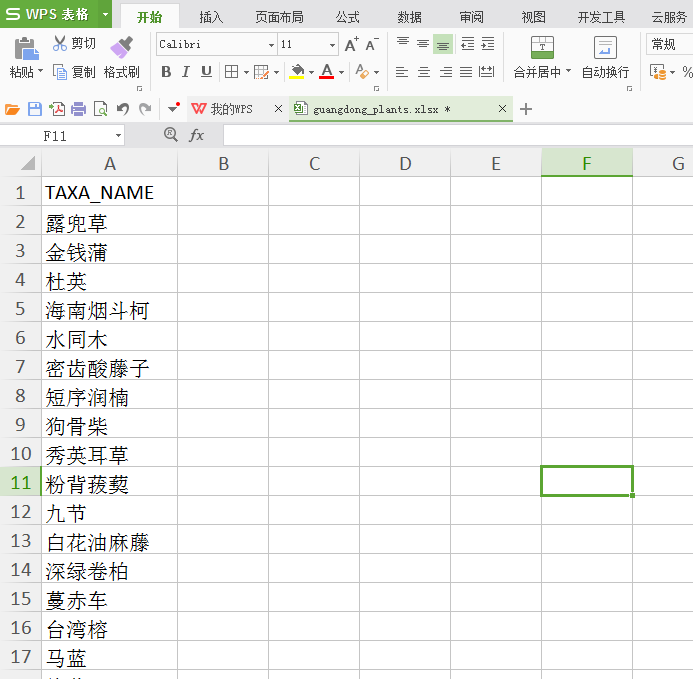

```{r setup, include = FALSE}
knitr::opts_chunk$set(
  collapse = TRUE,
  comment = "#>"
)
```

# 简介

plantlist是用来查询和处理植物学名的R程序包。类似的R程序包还有taxize (https://cran.r-project.org/web/packages/taxize/index.html)、Taxonstand(https://cran.r-project.org/web/packages/Taxonstand/index.html)等，相比之下plantlist的主要特点在于：
1. 使用程序包自带的数据，不依赖网络数据库
2. 优化了查询单个物种的算法，速度比taxize更快
3. 查询结果所显示的信息更加简洁明确
4. 用中文名批量查询学名等

## plantlist主要功能

1.  批量查询植物科属，内置的数据主要来源于The Plant List网站(www.theplantlist.org/)，其中被子植物采用APGIII分类系统，同时提供维管植物每个科的编号，方便标本馆管理植物标本。
2.  直接生成科/属/种的列表, 以便通过Phylomatic等软件生成进化树
3.  用中文名批量查询植物学名以及科属
4.  查询学名的接受状态以及完整学名等

## plantlist包内的函数

* `CTPL` 通过中文名查询植物的完整学名和科属
* `CTPL2` 通过中文名查询每个种的科、属、分布、海拔、IUCN等级数据
* `status` 查询每个学名在The Plant List 1.1数据库中的接受状态
* `taxa.table` 基于TPL查询结果制作科属种列表， 以便用Phylomatic软件建立进化树
* `TPL` 提供学名， 查询目、科、属以及科在分类系统中的编号

## plantlist包内的数据集

* `acc_dat` 数据集 The Plant List网站上所有接受名
* `cnplants` 数据集 《中国植物名录》及每个种的科、属、分布、海拔、IUCN等级数据
* `syn_dat` 数据集 The Plant List 1.1 网站异名数据库

# 软件安装

plantlist必须要先安装R才能使用。由于plantlist内部函数`CTPL2`函数需要使用openxlsx读取xlsx文件，所以本程序包在安装时需要安装openxlsx所依赖的Rtools以及Rcpp，并配置好启动路径。本部分介绍如何安装。

## 安装R软件

R软件下载的地址为:<http://cran.r-project.org/bin/windows/base/>，请按照默认路径安装R软件，请尽量安装最新版本的R。因为涉及到UFT8字符转换，R版本不能低于3.0.3。

{ width=90% }

图1. R软件windows版本下载页

{ width=90% }

图2. R软件3.3.1的登录界面

## 安装Rtools

Rtools是编写R程序包的工具软件，含有读写xlsx文件所需的unzip和zip函数，安装时必须允许Rtools修改启动路径，以便从控制台中调用zip等命令读写Excel模板。

Rtools的下载地址为<https://cran.r-project.org/bin/windows/Rtools/>。安装Rtools时须允许其修改系统路径system PATH，以便从控制台中可以直接使用Rtools的zip等命令。

{ width=90% }

图3. Rtools下载页面，**请以未冻结的版本为准**

{ width=90% }

图4. 安装Rtools时应该允许其修改system PATH

## 检查Rtools是否已正确配置

Rtools安装完成后可以通过以下方式检查是否安装成功:

{ width=90% }

图5. 在控制台中输入zip, 如图所示，若未提示错误，则Rtools配置成功

## 安装openxlsx程序包

openxlsx程序包，用来读写标本数据的xlsx模板， 在RGUI的命令行中输入：
```R
install.packages("openxlsx")
```
在弹出的窗口选择距离较近的CRAN镜像，openxlsx程序包会自动下载并安装好。部分地区由于网络限制，不一定能打开r-project网站的云服务，可以尝试用以下命令:

```R
install.packages("ctv", repos = "http://cran.R-project.org")
```

其中的 http://cran.R-project.org 可以替换为任何CRAN镜像名。CRAN镜像列表为：https://cran.r-project.org/mirrors.html

{ width=90% }

图6. 通过`install.packages`命令安装openxlsx程序包

## 从Rforge 安装 plantlist

网址是 <https://r-forge.r-project.org/R/?group_id=2052>

命令是 `install.packages("plantlist", repos="http://R-Forge.R-project.org")`

{ width=90% }

图7. Rforge网站上plantlist的页面

plantlist源代码也保存在github， 网址是<https://www.github.com/helixcn/plantlist>。

至此，plantlist及其依赖的程序包已经完成安装。

# plantlist各函数的使用方法

在使用plantlist之前，必须用`library(plantlist)` 加载plantlist。每个函数的使用方法， 请输入`?函数名`， 例如： `?TPL` 查询TPL函数的用法。

## `CTPL` 通过中文名查询植物的完整学名和科属 

（该函数现已不再维护，用户应该考虑尽量使用CTPL2）

## `CTPL2()` 通过中文名查询每个种的科、属、分布、海拔、IUCN等级数据

例如 Excel文件保存在 `D:/data/` 文件夹下，文件名为 guangdong_plants.xlsx

用法

```R
setwd("D:/data/")
library(plantlist)
CTPL2(infile = "guangdong_plants.xlsx", outfile = "results.xlsx")
```

注意， 输入的中文名不能有空格， 否则将不能正确匹配。

{ width=90% }

图8. guangdong_plants.xlsx文件的内容

{ width=90% }

图 9. CTPL2查询结果，该文件保存在D:/data/ 文件夹下。

## `status` 查询每个学名在The Plant List 1.1 接受状态

函数的参数 `status(species =NA, exact =TRUE, spell_error_max =NULL)`

* `species`为输入的字符串向量。

* `exact`表示是否进行精确匹配，如果不是精确匹配，则所有能用grep正则表达式匹配的结果都会显示。一般建议用精确匹配。

* `spell_error_max` 为所允许的最大的错误拼写的字母数量。

* `status`函数对输入的species物种名大小写不敏感,物种名的前后以及中间允许有多个空格，
species可以通过包括或者不包括命名人（变型f.之前的命名人除外）。`status`函数可以用来查询变种var.  亚种 subsp. 以及变型f. 否接受等信息.

### 使用方法:

```R
library(plantlist)

## 建立物种名单
sp <-c("Elaeocarpus decipiens",
"Syzygium buxifolium",
"Daphniphyllum oldhamii",
"Loropetalum chinense",
"Rhododendron latoucheae",
"Rhododendron ovatum",
"Vaccinium carlesii",
"Schima superba")

### 检查名单内每个种的接受情况以及接受名
status(sp)

### 检查一个种的接受情况
status("Myrica rubra") ## 杨梅
status("Adinandra millettii") ## 杨桐
status("cyclobalanopsis neglecta ") ## 竹叶青冈
status("Lirianthe henryi") ### 大叶木兰

#### 同时检查几个学名的状态
status(c("Myrica rubra", "Adinandra millettii",
"Machilus thunbergii", "Ranunculus japonicus",
"Cyclobalanopsis neglecta"))

### Check the statusof a scientific name (with or without authorship)
### 查询学名是否接受
status("Hypoxis filifolia")

### Subspecies (withor without authorship)
### 查询亚种是否接受
status("Hypoxis kilimanjarica subsp. kilimanjarica")

### Variaty (with orwithout authorship)
### 查询变种是否接受
status("Hypoxis erecta var. aestivalis")

### Form (with orwithout authorship)
### 查询变型是否接受
status("Hypoxis hirsuta f. villosissima")

### 重要提示： 由于表示变型的 f. 有时也用于命名人中，
### 因此，用status函数在查询变型时， 请勿为种添加命名人，
### 但是变型的命名人可以提供或者不提供，具体为:
"Hypoxis hirsuta (L.)Coville f. vollosissima Fernald".（不能处理）
"Hypoxis hirsuta f. vollosissima Fernald"（能处理）
"Hypoxis hirsuta f. vollosissima"（能处理）
```

`taxa.table` 基于TPL查询结果制作科属种列表， 以便用于Phylomatic软件建树
举例：

```R
sp <- c( "Ranunculus japonicus", "Anemone udensis",
"Ranunculus repens", "Ranunculus chinensis",
"Solanum nigrum", "Punica sp." )
res <- TPL(sp)
taxa.table(res)
```
## TPL根据拉丁学名，查询目、科、属、以及科的编号

TPL函数 输入的数据必须是字符串格式的向量。可以查询科、属、种的相应信息， 但是并不查询学名是否有效。查询学名是否有效， 请用`status`函数

```R
TPL("Carex") # 查询薹草属
TPL("Apple") # 查询苹果的英文名
splist <- c("Ranunculus japonicus", "Solanum nigrum",
"Punica sp.", "Machilus", "Today", "####" ) ### 查询多个种
res <- TPL(splist)
```

# 引用

Jinlong Zhang (2017). plantlist: Looking Up the Status of Plant
Scientific Names based on The Plant List Database. R package version
0.3.0. <https://github.com/helixcn/plantlist/>

# 致谢

感谢高芳銮、李嵘、胡晓丽、冯嘉恩、黄世芳、俞筱押、胡海花、李家湘、刘水银、鲍志贵、张美霞、葛斌杰、孔德良、刘振稳、龙文兴、金建军等各位老师同学试用本软件并提出宝贵意见。

# 参考文献

* 多识团队. (2016至今). 多识植物百科. http://doucet.ibiodiversity.net/.

* 刘冰, 叶建飞, 刘夙, 汪远, 杨永, 赖阳均, 曾刚，林秦文. (2015). 中国被子植物科属概览: 依据 APG III 系统. 生物多样性, 23(2), 225-231.

* 环境保护部, 中国科学院 (2013) 《中国生物多样性红色名录——高等植物卷 》 电子版来源： www.mep.gov.cn/gkml/hbb/bgg/201309/W020130917614244055331.pdf

* Christenhusz, M., Zhang, X. C., and Schneider, H. (2011a). A linear sequence of extant families and genera of lycophytes and ferns. Phytotaxa. 19:7-54

* Christenhusz, M., Reveal, J., Farjon, A., Gardner, M. F., Mill, R. R., and Chase, M. W. (2011b). A new classification and linear sequence of extant gymnosperms. Phytotaxa. 19:55-70
